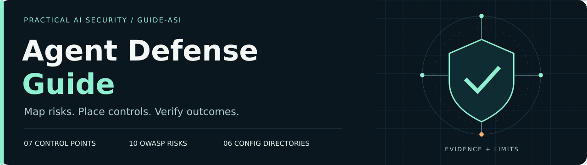

# Гайд по защите ИИ-агентов



**Практическая безопасность ИИ-агентов: риски OWASP, open-source контроли, воспроизводимые примеры и границы защиты.**

[](https://github.com/Andy9542/guide-asi/actions/workflows/selftest.yml)
[](LICENSE)
[](configs/LICENSE)

**[Быстрый старт](docs/quickstart.ru.md) · [7 точек внедрения](#точки-внедрения) · [10 рисков](risks/) · [Конфиги](configs/) · [Пробелы](gaps.md) · [English](README.md)**

Агент вызывает инструменты, исполняет код или пользуется общей памятью? Этот гайд помогает
решить, **где поставить контроль, что именно развернуть и как проверить результат**.

Внутри: **7 точек внедрения, 10 страниц рисков OWASP, 25 инструментов, 6 каталогов
конфигов и матрица покрытия для 20 сценариев атаки и 46 методов защиты**.
Числа описывают содержимое репозитория; у оценки зрелости каждого инструмента есть дата проверки.

Обзор, быстрый старт и правила участия доступны на русском и английском. Подробные
страницы рисков, точек внедрения и инструкции к конфигам пока на русском.

## Первый результат

Запустите проверки классификатора результатов: достаточно **Python 3.10+ и стандартной библиотеки**.

```sh
git clone https://github.com/Andy9542/guide-asi.git
cd guide-asi
python3 configs/redteam/classify_test.py
```

Ожидаемая последняя строка:

```text
classify_test: 58 случаев, расхождений 0
```

Проверки показывают, что обвязка различает успешную оценку, провал проверки и прогон,
в котором вердикт получить не удалось. Используются локальные фикстуры формата
выгрузки promptfoo; вызова модели и измерения её стойкости здесь нет.
После клонирования этому шагу не нужны сеть, API-ключ, Docker или Node.js.

**[Продолжить быстрый старт →](docs/quickstart.ru.md)**: валидация конфигов,
локальный echo-прогон и зависимости полной самопроверки.

## Как пользоваться

- **Агент вызывает инструменты или MCP:** начните со [шлюза инструментов](points/02-tool-gateway.md)
  и [политик OPA](configs/opa/).
- **Агент устанавливает пакеты или навыки:** проверьте [цепочку поставок](points/03-supply-chain.md)
  и [пример Semgrep + OSV](configs/semgrep/).
- **Агенты обмениваются сообщениями:** изучите [идентичность и шину](points/05-identity.md)
  и [пример подписи Ed25519](configs/bus-signing/).
- **Нужно проверить архитектуру:** пройдите по [точкам внедрения](#точки-внедрения),
  [рискам](risks/) и [пробелам](gaps.md).
- **Выбираете инструмент:** откройте [шорт-лист](data/tools.csv),
  [причины исключения кандидатов](data/rejected.csv) и [описание полей](data/README.md).

## Точки внедрения

Риски пронумерованы по [OWASP Top 10 for Agentic Applications 2026](https://genai.owasp.org/resource/owasp-top-10-for-agentic-applications-for-2026/)
(ASI01–ASI10). Связь с риском в таблице указывает, что изучать; степень покрытия
и ограничения объяснены на соответствующей странице.

| Где поставить контроль | Примеры и материалы | Связанные риски |
|---|---|---|
| [01 · Шлюз вызовов модели](points/01-llm-gateway.md) | [Конфиг LiteLLM](configs/litellm/) · ключи и доступ к моделям | ASI03, ASI08 |
| [02 · Шлюз инструментов и MCP](points/02-tool-gateway.md) | [Политики OPA](configs/opa/) · agentgateway · Pipelock · гардрейлы контента | ASI01, ASI02, ASI03, ASI09 |
| [03 · Цепочка поставок](points/03-supply-chain.md) | [Semgrep + OSV-Scanner](configs/semgrep/) · agent-scan | ASI04, ASI05 |
| [04 · Песочница исполнения](points/04-sandbox.md) | E2B · agent-sandbox · gVisor | ASI02, ASI03, ASI05 |
| [05 · Идентичность и шина](points/05-identity.md) | [Подпись сообщений](configs/bus-signing/) · Agent Governance Toolkit · SpiceDB | ASI03, ASI07, ASI10 |
| [06 · Память и RAG](points/06-memory.md) | Происхождение памяти · кандидат OWASP Agent Memory Guard · [пробел](gaps.md) | ASI06 |
| [07 · Телеметрия и red-team](points/07-observability.md) | [Спаны решений](configs/otel/) · [обвязка promptfoo](configs/redteam/) · инструменты оценки | ASI08, ASI10 |

Телеметрия и red-team дают **измерение и обнаружение**: помогают выяснить, сработал
ли контроль. Сами по себе они не останавливают атаку.

## Метки доказательности

Подробные страницы различают три уровня доказательности:

- **`[стенд]`** — результат наблюдался на стенде авторов; рядом описаны конфиг,
  измеренное поведение и границы эксперимента.
- **`[дока]`** — утверждение опирается на документацию инструмента; в репозитории его не проверяли.
- **`[пробел]`** — подходящее зрелое решение в рамках исследования не установлено.

У четырёх каталогов есть исполняемый `selftest.sh`: **OPA, Semgrep/OSV, подпись сообщений
и red-team**. Полный набор выполняется в [GitHub Actions](https://github.com/Andy9542/guide-asi/actions/workflows/selftest.yml).
Для интеграционных проверок LiteLLM и OpenTelemetry нужен ещё и живой стенд.
Зелёный CI подтверждает результаты своих проверок; производственная готовность и
полное покрытие рисков требуют отдельной оценки.

## Что ещё внутри

- **[tools.csv](data/tools.csv):** 25 инструментов, точки внедрения, метки доказательности,
  лицензии, сигналы зрелости и даты проверки.
- **[matrix.csv](data/matrix.csv):** 181 связь «сценарий — метод» для 20 сценариев атаки
  и 46 методов защиты, с оценками покрытия.
- **[rejected.csv](data/rejected.csv):** 8 кандидатов и зафиксированные причины исключения.
- **[tools_raw.csv](data/tools_raw.csv):** исходный каталог из 118 кандидатов для дальнейшего исследования.

Перед сравнением записей прочитайте [описание полей](data/README.md). Оценки покрытия
относятся к записанной методике и не являются универсальными баллами защищённости.

## Как отбирались инструменты

Шорт-лист проверен **09.09.2026** по трём критериям: установленная лицензия и её
обязательства, активность проекта за последние полгода, признаки эксплуатации.
OSV-Scanner, gVisor и OWASP Agent Memory Guard рассмотрены дополнительно к исходному
каталогу, чтобы описать соответствующие точки внедрения; ограничения зрелости и
доказательности сохранены в карточках. Даты по каждой записи находятся в данных.

## Границы гайда

В центре — **агентный слой**: граница, на которой текст модели становится вызовом
инструмента, исполнением кода, записью в память или сообщением другому агенту.
Применяйте его вместе с сетевым, системным и прикладным харденингом.

Конфиги — учебные примеры. Перед адаптацией проверьте зависимости, плейсхолдеры,
доверенные входы и ограничения развёртывания. Скомпрометированный агент способен
подписать вредоносное сообщение своим ключом; политике нужна точка принудительного
исполнения; результат оценки относится только к проверенным сценариям.

## Дополнить

Хороший первый вклад: повторить один пример, исправить устаревшую запись об инструменте,
перевести страницу или принести доказательства для одного из [пробелов](gaps.md).

**[Предложить инструмент или исправление](https://github.com/Andy9542/guide-asi/issues/new/choose)** ·
**[Как участвовать](CONTRIBUTING.ru.md)**

Если гайд помог вам спроектировать или проверить агентную систему, **поставьте звезду**,
чтобы вернуться к нему, и поделитесь конкретным контролем или примером, который пригодился команде.

## Авторы и лицензии

**Андрей Яковлев и Анастасия Истомина.**

Текст и данные — **[CC BY-SA 4.0](LICENSE)**. Код в `configs/` и `build/` —
**[Apache-2.0](configs/LICENSE)**. Авторские визуальные материалы — **CC BY-SA 4.0**.
Описания рисков OWASP адаптированы с атрибуцией; гайд является независимым проектом.
Подробности — в [NOTICE.md](NOTICE.md).
